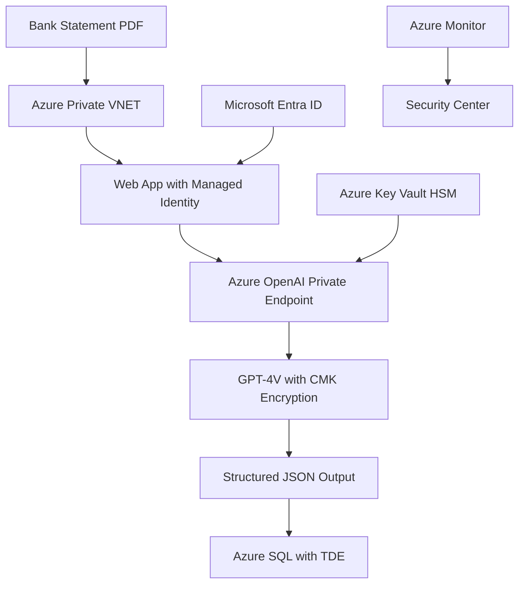

# Enterprise LLM Security for Bank Statement Processing

## 🔒 Secure LLM Deployment Options

There are several enterprise-grade options for secure LLM deployment that can handle sensitive financial documents like bank statements.

## 🏛️ Microsoft Azure OpenAI Enterprise Solutions

### **Azure OpenAI Service with Private Deployment**

**✅ Enterprise Security Features:**

- **Private Endpoints** - No public internet exposure
- **VNET Integration** - Completely isolated Azure virtual networks
- **Customer-Managed Keys (CMK)** - You control all encryption keys
- **Microsoft Entra ID** - Enterprise authentication and RBAC
- **Azure Government Cloud** - FedRAMP compliance for government/financial
- **Data Residency** - Data stays in your specified geography

**Key Security Guarantees:**

```yaml
Data Protection:
  - Your prompts: NOT available to other customers
  - Your data: NOT available to OpenAI
  - Training: NOT used to improve OpenAI models
  - Model Access: Your fine-tuned models are exclusive
  - Encryption: FIPS 140-2 compliant 256-bit AES
  - Network: Private endpoints only, no public access
```

### **Microsoft for Sovereignty (Preview)**

**🌟 Ultra-Secure Option for Financial Services:**

- **Confidential Computing** - Data encrypted even during processing
- **Hardware Security Modules (HSM)** - Tamper-resistant key storage
- **Sovereign Landing Zones** - Complete data sovereignty control
- **Zero Trust Architecture** - Assume breach, verify everything

**Architecture:**

```
Bank Statement Processing Pipeline:
├── Confidential Corp Landing Zone (private endpoints only)
├── Azure Confidential Computing VMs (encrypted in use)
├── Azure OpenAI with CMK (customer-managed encryption)
├── Private VNET (no internet exposure)
└── Audit Logging (immutable compliance records)
```

## 🏢 Alternative Enterprise LLM Providers

### **AWS Bedrock**

- **Amazon Bedrock** with VPC endpoints
- **Customer-managed keys** via AWS KMS
- **Private subnets** with no internet gateway
- **PrivateLink** for service isolation

### **Google Cloud Vertex AI**

- **Private Google Access** for completely offline processing
- **Customer-managed encryption keys** (CMEK)
- **VPC Service Controls** for data perimeter security
- **Private Service Connect** endpoints

### **On-Premises/Hybrid Solutions**

**1. Azure Stack HCI with Azure Arc**

- Run Azure OpenAI on your own hardware
- Data never leaves your premises
- Still get Microsoft updates and support

**2. NVIDIA NIM (NVIDIA Inference Microservices)**

- Deploy models like Llama 2, CodeLlama on your infrastructure
- GPU-accelerated inference on-premises
- Full control over data and model access

**3. Hugging Face Enterprise**

- Deploy open-source models internally
- Custom fine-tuning on your data
- No external API calls required

## 🏦 Financial Services Compliance Features

### **Regulatory Compliance Support**

```yaml
Compliance Standards:
  - SOC 2 Type II: ✅ Azure OpenAI certified
  - PCI DSS Level 1: ✅ Payment card data protection
  - FedRAMP High: ✅ Azure Government cloud
  - FIPS 140-2: ✅ Cryptographic standards
  - ISO 27001: ✅ Information security management
  - HIPAA: ✅ Healthcare data protection (applies to financial PII)
```

### **Data Protection Guarantees**

- **Encryption at Rest** - AES-256 with customer-managed keys
- **Encryption in Transit** - TLS 1.2+ for all communications
- **Encryption in Use** - Confidential computing for processing
- **Zero Data Retention** - No prompts/responses stored by provider
- **Geographic Boundaries** - Data processing within specified regions

## 🏗️ Recommended Architecture for Bank Statements

### **Phase 1: Azure OpenAI Private Deployment**



**Security Implementation:**

```yaml
Network Security:
  - No public endpoints
  - Private DNS zones
  - Network Security Groups with deny-all default
  - Azure Firewall for outbound filtering

Identity & Access:
  - Managed Identity for authentication
  - RBAC with least privilege
  - Conditional Access policies
  - MFA required for all access

Data Protection:
  - Customer-managed keys in HSM
  - Zero data retention policy
  - End-to-end audit logging
  - Immutable backup retention
```

### **Phase 2: Confidential Computing Enhancement**

```yaml
Ultra-Secure Configuration:
  Infrastructure:
    - Azure Confidential VMs (AMD SEV-SNP)
    - Encrypted memory during processing
    - Attestation-based trust verification

  Model Deployment:
    - Private model hosting in secure enclaves
    - Encrypted model weights and inference
    - Zero-knowledge processing guarantees

  Compliance:
    - Hardware-based root of trust
    - Cryptographic proof of security
    - Regulatory audit trail
```

## 💰 Cost Analysis

### **Azure OpenAI Private Deployment**

```yaml
Monthly Costs (Estimated):
  Base Infrastructure:
    - Azure OpenAI (GPT-4V): $2,000-5,000/month
    - Private Endpoints: $50/month per endpoint
    - VNET/Subnets: $100/month
    - Key Vault HSM: $1,500/month

  Processing Volume:
    - 1,000 bank statements/month: ~$500-1,000
    - 10,000 statements/month: ~$5,000-10,000

  Total: $4,150-17,650/month
```

### **Confidential Computing Premium**

```yaml
Additional Costs:
  - Confidential VMs: +50-100% compute cost
  - Enhanced security monitoring: +$500/month
  - Compliance certification: $10,000-50,000 one-time

Total Premium Solution: $6,000-30,000/month
```

## 🚀 Implementation Roadmap

### **Week 1-2: Foundation Setup**

- [ ] Azure subscription with Enterprise Agreement
- [ ] Azure OpenAI service approval and provisioning
- [ ] Private VNET configuration
- [ ] Customer-managed key setup in Key Vault HSM

### **Week 3-4: Security Hardening**

- [ ] Private endpoint configuration
- [ ] Network security group rules
- [ ] Managed identity and RBAC setup
- [ ] Audit logging and monitoring

### **Week 5-6: Application Development**

- [ ] Bank statement processing application
- [ ] GPT-4V integration with private endpoints
- [ ] Structured output validation
- [ ] Security testing and penetration testing

### **Week 7-8: Compliance Validation**

- [ ] Security assessment by third-party auditor
- [ ] Regulatory compliance verification
- [ ] Documentation and procedures
- [ ] Staff training and go-live

## 🔍 Security Validation Checklist

### **Data Flow Security**

- [ ] No data leaves Azure private network
- [ ] All communications use private endpoints
- [ ] Customer-managed encryption keys validated
- [ ] Zero data retention by LLM provider confirmed

### **Access Control**

- [ ] Multi-factor authentication enforced
- [ ] Role-based access control implemented
- [ ] Conditional access policies active
- [ ] Privileged access management configured

### **Compliance Verification**

- [ ] SOC 2 Type II compliance validated
- [ ] Industry-specific requirements met
- [ ] Data residency requirements satisfied
- [ ] Audit trail completeness verified

## 📋 Vendor Comparison Summary

| Provider                  | Security Level | Compliance | Cost      | Deployment |
| ------------------------- | -------------- | ---------- | --------- | ---------- |
| **Azure OpenAI Private**  | ⭐⭐⭐⭐⭐     | Excellent  | Medium    | 2-4 weeks  |
| **Azure Confidential**    | ⭐⭐⭐⭐⭐     | Maximum    | High      | 6-8 weeks  |
| **AWS Bedrock Private**   | ⭐⭐⭐⭐       | Good       | Medium    | 3-5 weeks  |
| **Google Vertex Private** | ⭐⭐⭐⭐       | Good       | Medium    | 3-5 weeks  |
| **On-Premises NVIDIA**    | ⭐⭐⭐⭐⭐     | Maximum    | Very High | 8-12 weeks |

## 🎯 Recommendation

**For Bank Statement Processing:**

1. **Start with Azure OpenAI Private Deployment**
   - Fastest time to value (2-4 weeks)
   - Enterprise-grade security out of the box
   - Proven compliance for financial services

2. **Enhance with Confidential Computing** (if required)
   - Ultimate security for most sensitive use cases
   - Hardware-based guarantees
   - Regulatory audit satisfaction

3. **Implement Zero-Trust Architecture**
   - Assume breach mentality
   - Verify everything, trust nothing
   - Continuous security monitoring

**Bottom Line:** Yes, secure enterprise LLM deployment is absolutely possible for bank statement processing. Azure OpenAI with private endpoints, customer-managed keys, and VNET isolation provides bank-grade security while maintaining the power of GPT-4V for document understanding.

The key is proper architecture and configuration - the technology exists today to process sensitive financial documents securely in the cloud.
